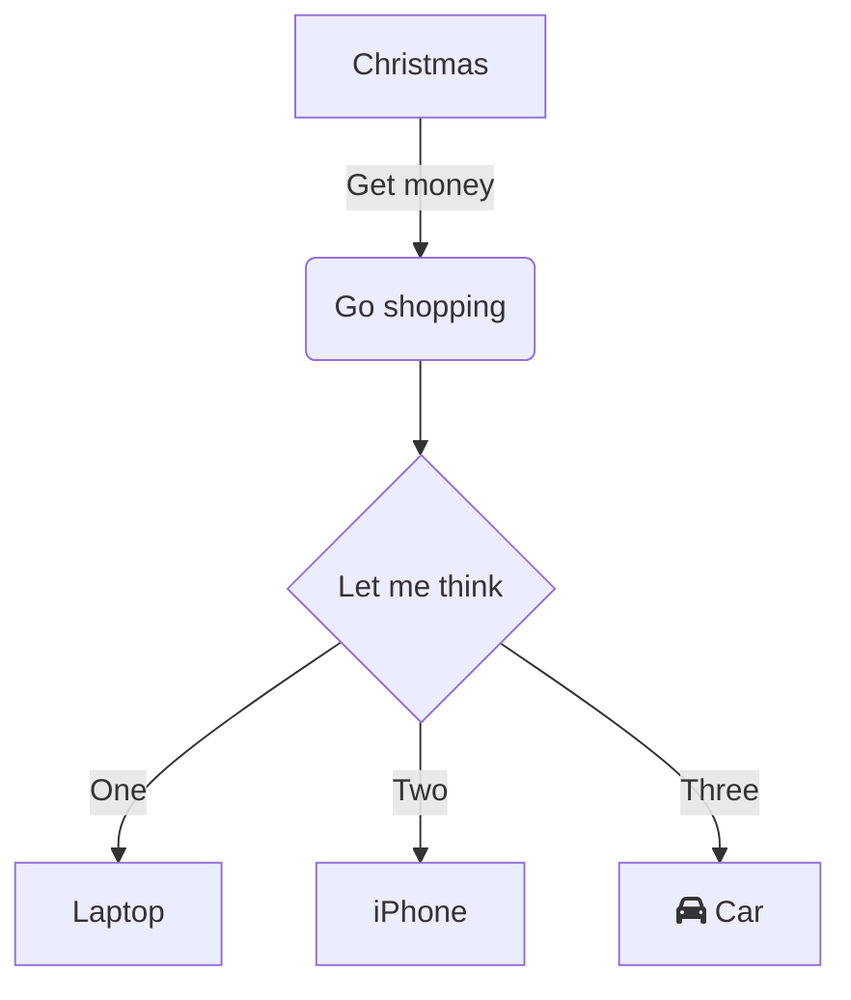
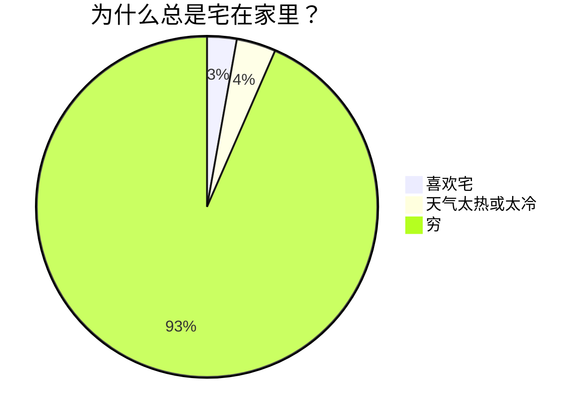
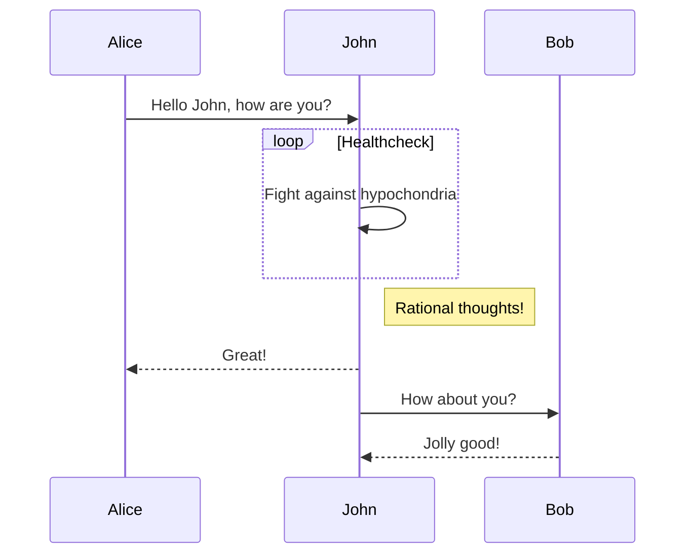
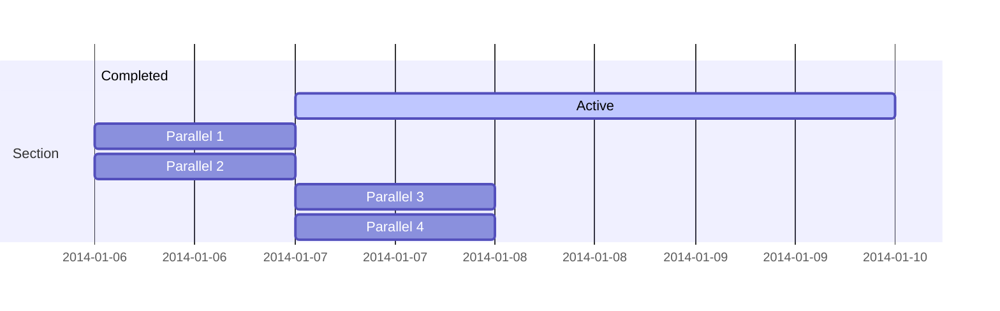

## 一、概述

Mermaid(美人鱼)是一种基于Javascript的绘图工具，使用类似于Markdown的语法，使用户可以方便快捷地通过代码创建图表。
项目地址：[https://github.com/mermaid-js/mermaid](https://github.com/mermaid-js/mermaid)

Mermaid支持以下类型的图形：

- 流程图：使用`graph`关键字，具体用法后文将详细介绍
- 饼状图：使用`pie`关键字，具体用法后文将详细介绍
- 序列图：使用`sequenceDiagram`关键字
- 甘特图：使用`gantt`关键字
- 类图：使用`classDiagram`关键字
- 状态图：使用`stateDiagram`关键字
- 用户旅程图：使用`journey`关键字

## 二、HEXO如何引入mermaid插件

对于`hexo-theme-next`主题插件，从`8.11.0`版本开始内置mermaid支持，不再需要手工安装js模版文件了，具体步骤为：

1. 确认`hexo-theme-next`的版本号高于`8.11.0`
2. 确认已安装`hexo-filter-mermaid-diagrams`，当前版本号是`1.0.5`；如果没有安装，则：

    ```bash
    npm install hexo-filter-mermaid-diagrams
    ```

3. 找到位于HEXO根目录的`_config.next.yml`，寻找`mermaid`段落并设置开关`enable: true`

    ``` yaml
    # Mermaid tag
    mermaid:
      enable: false # 此处修改为true！！！
      # Available themes: default | dark | forest | neutral
      theme:
        light: default
        dark: dark
    ```

4. 此时应该可以在文档中编写并展现流程图了。
   如果不能正常展示，可能需要重新生成js文件，输入命令:

    ```bash
    npm clean && npm generate && npm server
    ```

> 其实，vscode也可以引入mermaid，其插件名称是`Markdown-preview-enhanced`

## 三、常用图形示例

使用时需要在代码块声明中标注**mermaid**，然后内容体中表明图形类型，再逐一描述各个节点信息。


### 1. 流程图（graph关键字）

```txt
graph TD
  A[Christmas] -->|Get money| B(Go shopping)
  B --> C{Let me think}
  C -->|One| D[Laptop]
  C -->|Two| E[iPhone]
  C -->|Three| F[fa:fa-car Car]
```



### 2. 饼图（pie关键字）

```txt
pie
  title 为什么总是宅在家里？
  "喜欢宅" : 15
  "天气太热或太冷" : 20
  "穷" : 500
```



> 饼图最多支持9种不同的颜色

### 3. 时序图（sequenceDiagram关键字）

```txt
sequenceDiagram
  Alice->>John: Hello John, how are you?
  loop Healthcheck
      John->>John: Fight against hypochondria
  end
  Note right of John: Rational thoughts!
  John-->>Alice: Great!
  John->>Bob: How about you?
  Bob-->>John: Jolly good!
```



### 4. 甘特图（gantt关键字）

``` txt
gantt
section Section
  Completed :done, des1, 2014-01-06,2014-01-08
  Active       : active, des2, 2014-01-07, 3d
  Parallel 1   : des3, after des1, 1d
  Parallel 2   : des4, after des1, 1d
  Parallel 3   : des5, after des3, 1d
  Parallel 4   : des6, after des4, 1d
```



---

## 参考文献

- [mermaid 官方源码](https://github.com/mermaid-js/mermaid)
- [hexo-filter-mermaid-diagrams 的官方源码](https://github.com/webappdevelp/hexo-filter-mermaid-diagrams)
- [重点推荐！Mermaid从入门到入土——Markdown进阶语法](https://zhuanlan.zhihu.com/p/355997933)
- [利用 Markdown 语法画 mermaid 流程图](https://juejin.cn/post/7030074642559664135)
