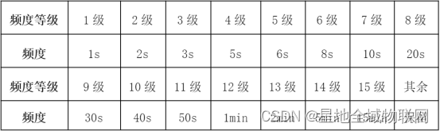
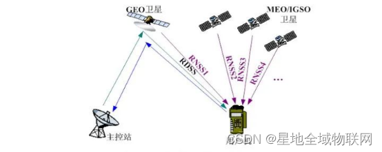
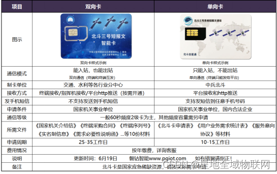
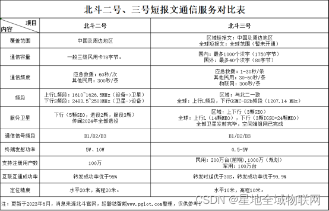
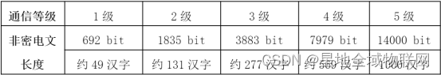

北斗卫星导航系统（Beidou Navigation Satellite System）是中国自主研发和建设的全球卫星导航系统。该系统由一系列卫星、地面监控站和用户终端组成，旨在提供高精度、高可靠性的定位、导航和授时服务。北斗卫星导航系统的发展始于 20世纪 90 年代，经过多年的努力，目前已经成为全球四大卫星导航系统之一，与美国的 GPS、俄罗斯的 GLONASS 和欧盟的 Galilei 并列。

## 一、概述

卫星导航系统通常包含多种类型的卫星：

- MEO 中圆轨道卫星负责提供最基础的服务，但精度有限，主要作用是完成信号地标无死角的卫星信号覆盖。
- GEO 地球静止卫星在区域导航服务方面具有明显优势，卫星利用率高，属于导航系统中的增强系统，可以起到星间通信和地表通信功能，是提高导航定位精度的杀手锏。
- IGSO 倾斜地球同步轨道卫星是延伸补充，重点解决高纬度（尤其南北极地区）低仰角的问题。低仰角下的卫星信号受到大气延迟、多路径效应和观测噪声的严重影响，从而导致产生较大的误差。

### 北斗一号（验证系统）

1994 年开始建设，2000 年建成，共有 2 颗 GEO 卫星。2003 年又发射了一颗补充卫星。
北斗一号使用的有源定位，仅为中国境内服务。
2013 年，北斗一号已经光荣退休！

### 北斗二号（扩展的区域导航系统）

2004 年开始建设，2012 年建成，包含 14 颗卫星（ `GEO * 5 + MEO * 4 + ISGO * 5`），此外还有 6 颗试验或备份卫星。
北斗二号采取有源与无源相结合体制，服务范围为整个亚太地区。定位精度为 10 米，测速精度为 0.2 米/秒，授时精度为 50 纳秒，短信字数每次为 120 个字。
目前，北斗二号与北斗三号同时使用，并完全兼容北斗三号的信号。

### 北斗三号（全球卫星导航系统）

2009 年开始建设，2020 年建成，包含 30 颗卫星（ `GEO * 3 + MEO * 24 + ISGO * 3`），此外还有 5 颗试验或备份卫星。
北斗三号采取有源与无源相结合体制，服务范围为全球。定位精度为 10 米，测速精度为 0.2 米/秒，授时精度为 20纳秒，每次短信字数也增加了。付费用户提供更高精度等级（2.5～5 米）的定位服务。
此外，北斗三号在载荷、星间链路、激光通信等方面也有进步。如北斗三号采用星载氢原子钟，其精度将比北斗二号的星载铷原子钟提高一个数量级。又如，北斗三号增加了卫星搜救功能和全球位置报告功能。

## 二、北斗的信号体制

信号体制的英文名是 signal system，它主要指的是卫星导航信号，分为四个部分，一是载波频率，二是调制方式，三是测距码，四是导航电文。信号体制是我们国内的说法，实际上它研究的是信号体制的设计、产生、实现、处理等技术。

北斗-M1 是一个实验性的卫星，用于发射信号的测试和验证，并能以先占的原则确定对相应频率的使用权。北斗-M1 卫星在E2、E5B、E6频段进行信号传输，传输的信号分成2类，分别被称作“I”和“Q”。“I”的信号具有较短的编码，可能会被用来作开放服务（民用）， 而“Q”部分的编码更长，且有更强的抗干扰性，可能会被用作需要授权的服务（军用）。

## 二、北斗的定位服务

## 三、北斗的短报文服务

---

## 附录一：地球大气层的结构

按照温度来划分，地球大气层分为四个主要的层级（Layer），即：对流层、平流层、中间层和热成层。

- 对流层（Troposphere）：是最接近地球表面的层，其高度约为 10 公里，温度为 $15^\circ ～ -56^\circ$。其包含了地球大气中 75% 的质量和大部分的水蒸气，天气现象主要发生在这一层。
- 平流层（Stratosphere）：也称同温层，位于对流层之上，其高度约为 10～50 公里，温度为 $-65^\circ ～ -2^\circ$。其特点是**温度随高度升高而增加**，主要原因是臭氧层吸收太阳紫外线辐射。平流层中没有对流，风向和风速相对稳定，很适合民用飞机的巡航，军用飞机的高度也难以超过 30 公里。
- 中间层（Mesosphere）：位于平流层之上，其高度约为 50～85 公里，温度为 $-2^\circ ～ -86^\circ$。其特点是**温度随高度升高而降低**，因为臭氧层的加热作用减弱。
- 热成层（Thermosphere）：也称暖层，或者热层，是最外层的大气层，其高度约为 1,000 公里，温度为 $-86^\circ ～ 1200^\circ$。其特点是**温度高达几千度**，因为气体分子受到太阳紫外线辐射的强烈加热。这也是极光发生的地方。

> 一般认为，100 公里高度的卡门线（Kármán line）是国家领空的上限，超过此高度的飞行器被认为是航天器

热成层之上是外层空间（Exosphere），大气逐渐变得非常稀薄，直到与外太空的真空相接。外层空间没有明确的边界，气体分子可以逃逸到太空中。

从其他角度看，还有几个重要的层级概念：

- 臭氧层（Ozone Layer）：主要位于平流层，高度大约在 15～35 公里之间。在某些地区和条件下，臭氧分布可能延伸到对流层顶部或平流层更高处。
臭氧层主要由臭氧（$O_3$）分子组成，这些分子吸收太阳紫外线辐射，保护地球表面免受有害紫外线的直接照射。臭氧层的温度相对较低，但由于臭氧分子吸收紫外线辐射，这一层的温度可以比周围的大气层温度高。
- 电离层（Ionosphere）：主要位于热成层（部分位于中间层），高度大约在 60～1000 公里，是大气层中气体分子被太阳辐射电离，形成带电粒子（离子和自由电子）的区域。
电离层中最显著的部分是 D层、E层和 F层，它们分别对应不同的高度和电离程度。电离层对无线电通信非常重要，因为它可以反射或折射无线电波，使得无线电信号能够跨越大距离传播。太阳活动强烈时对无线电波的传播有显著影响。

## 附录二：地球卫星轨道

地球卫星作为航天器的一种，其最低轨道高度一般在 1000 公里以上。

### 1. 近地轨道（LEO）

LEO（Low  Orbit，近地轨道，也称低地轨道），一般高度在 300～2000 公里，卫星运转周期从大约 90 分钟到几小时不等，轨道形状接近圆形。

由于近地轨道卫星离地面较近，绝大多数对地观测卫星、测地卫星、空间站以及一些新的通信卫星系统（马斯克的星链、中国的星网等）都采用近地轨道。在近地轨道的物体仍然受到热气体阻力影响，因此高度通常不低于 300 公里，同时还要考虑尽量避开范艾伦辐射带。

### 2. 中圆地球轨道（MEO）

MEO（Medium Earth Orbit，中地球轨道，也称中圆轨道），一般高度在 2,000~35,786 公里，卫星运转周期在 2～24 小时之间，但大部分在 12 小时左右，轨道形状接近正圆形。

运行于中地球轨道的卫星大都是导航卫星，例如，格洛纳斯系统位于 19,100 公里，GPS 位于 20,200 公里，北斗卫星导航系统位于 21,500 公里，伽利略定位系统位于 23,222 公里。部分跨越南北极的通信卫星也使用中地球轨道，最早的通信卫星 Telstar 也是使用的这条轨道。

### 3. 地球静止轨道（GEO）

GEO（Geostationary Orbit，地球静止轨道，也称地球赤道同步轨道，或者正圆轨道），是指地球赤道面上方 35,786 公里的圆形轨道，卫星运转周期和地球自转周期（一恒星日，即 23 时 56 分 4 秒）相同，绕行速度约为 3.1 公里/秒，运行方向和地球自转方向一致。
GEO 是地球同步轨道（Geosynchronous orbit，GSO）的一个特例，强调其相对静止的特性。

在地面观测者看来，地球静止轨道卫星在天空固定不动的，因此布设 3 颗通讯卫星，即可实现除两极外的全球通讯，地面站天线只要对准卫星的定点位置就可以通讯，而不用转动天线，因此通信卫星、气象卫星和海洋监测卫星一般都运行在这个轨道。

### 4. 倾斜地球同步轨道（IGSO）

IGSO（Inclined Geosynchronous Orbit，倾斜地球同步轨道），也是一种地球同步轨道，其轨道高度和运转周期与 GEO 卫星相同，但其与地球赤道面的倾角不为 0 ，因此星下点轨迹是一个跨南北半球的 “8”字，与赤道相交于一点，该点常称之为交叉点。

### 5. 极地轨道同步轨道（SSO）

SSO（Sun-synchronous Orbit，极地轨道同步轨道，也称太阳同步轨道），也是一种地球同步轨道，其轨道平面和太阳始终保持相对固定的取向，轨道倾角接近 90 度。

SSO 卫星运行时能到达南北极区上空，即卫星能飞经全球范围的上空。需要在全球范围内进行观测和应用的气象卫星、导航卫星、地球资源卫星等都采用这种轨道。
倾斜轨道和极地轨道同步卫星从地球上看是移动的，但每天的同一时间可以经过特定的地区，因此通常用于科研、气象或军事情报的搜集，以及两极地区和高纬度地区的通信。

### 6. 地球同步转移轨道（GTO）

GTO（Geostationary Transfer Orbit，地球同步转移轨道），是指近地点在 1,000 公里以下、远地点为地球同步轨道高度（约36,000 公里）的**椭圆轨道**。

GTO 轨道是霍曼转移轨道的运用之一，经加速后可达地球静止轨道 GEO。

## 附录三：范艾伦辐射带

范艾伦辐射带，指在地球附近的近层宇宙空间中包围着地球的高能粒子辐射带，主要由地磁场中捕获的高达几兆电子伏的电子以及高达几百兆电子伏的质子组成，这些辐射会对人类身体和卫星设备造成巨大伤害。

范艾伦辐射带位于南北纬 $40 ^\circ ～ 50 ^\circ$ 之间，高度范围分两段：**内辐射带**的高能电子多，高度为 1,500～5,000 公里；**外辐射带**的高能质子多，高度为 13,000～20,000 公里，内外层之间存在范艾伦带缝，缝中辐射很少。

---

## 参考文献

- [“北斗”知多少？](https://blog.csdn.net/Gou_Hailong/article/details/106294886)
- [北斗一号、北斗二号、北斗三号的区别](https://blog.csdn.net/u010783226/article/details/108057660)
- [北斗简史：一文读懂国产导航的26年成长路](https://www.thepaper.cn/newsDetail_forward_7979721)
